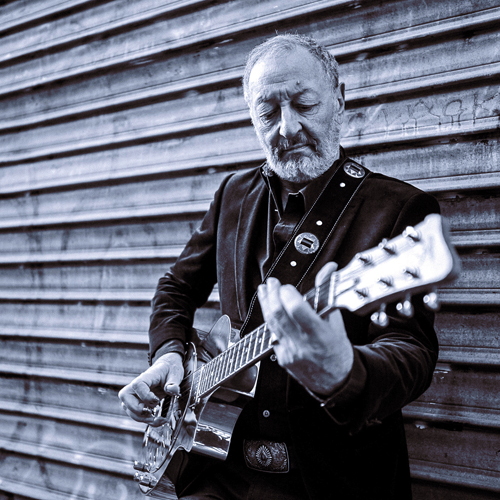

**Cisco HERZHAFT c’est un blues originel, joué par le vétéran du blues en France**, Cisco Herzhaft, aux guitares, au chant et les sons modernes d’un des meilleurs BeatBoxer français, Micflow (champion du monde de beatbox en équipe) sans oublier l’harmonica flamboyant de Geneviève Dartevelle et à la contrebasse, Stéphane Bihan, et son slap endiablé.
Blues originels ou compos personnelles, quelques folksongs et spirituals, ces sons traditionnels prennent une dimension aérienne et envoûtante portés par le rythme du beatbox. Et sans trahir l’esprit de cette musique qui, de tout temps, est associée aux sons de la voix....\
[\
www.cisco-herzhaft.com](www.cisco-herzhaft.com)\
[\
http://facebook.com/ciscoherzhaftofficiel/](http://facebook.com/ciscoherzhaftofficiel/)\
\
\
**1ere partie > Blues2men**\
Né pendant le confinement 2020, le duo atypique Blues2Men, s‘est persuadé de renouer avec ses profondes racines : le Blues.
Zeb & Richie, tous deux leaders du groupe "Les Maudits Waters", ont décidé de remettre sur les rails leur esprit « Loco Motive ». Généreusement imprégnés de culture blues noire américaine, ils distillent à travers, leur premier EP, une musique épurée, efficace, usée par les affres du temps. Résonateur et harmonica impliquent notre imagination au plus profond des légendes du mythique delta du Mississippi jusqu'au mystique « Crossroads ».
Beats imperturbables, gros riffs armés de bottleneck et harmonicas tonitruants colorent les textes métaphoriques scandés dans la pure tradition de la musique du diable, mais toujours ancrés dans la réalité. Le tout sublimé par la fée électricité.\
[\
https://www.blues2men.com/home](https://www.blues2men.com/home)